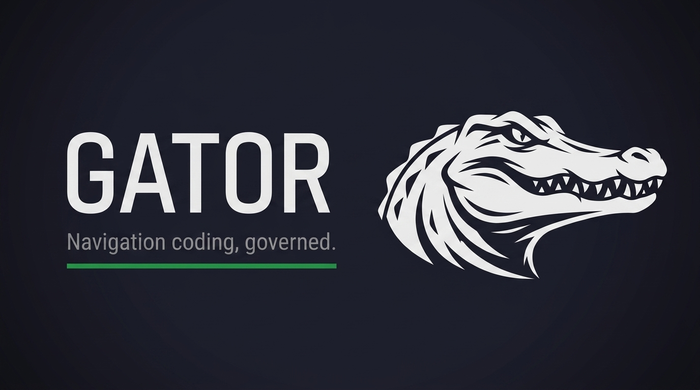
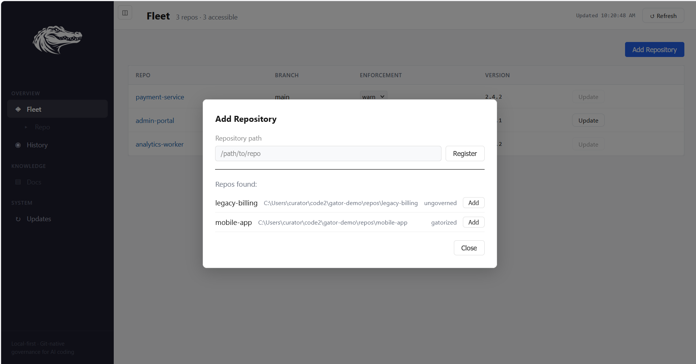

<!-- ASCII fallback:
  ....    .  .....  ...  ....
 / ___|  / \|_   _|/ _ \|  _ \    ....
| |  _  / _ \ | | | | | | |_) | ./( o )\_______
| |_/ \/ /_\ \| | | |_| |  _ <       _/vVvVvVvV
 \____/m/   \m\_|  \___/|m| \m\  \__.---------
-->



[](https://pypi.org/project/gator-command/) [](https://pypi.org/project/gator-command/) [](https://github.com/cumberland-laboratories/gator/blob/main/LICENSE) [](https://pypi.org/project/gator-command/)

  

Most AI coding tools generate code from local context. Gator is different: it makes models build *and maintain* a compact map of your codebase as they work, so architectural understanding survives across sessions instead of being rediscovered each time.

Further, Gator guides models in maintaining a human-readable project knowledge base for roadmaps, features, issues, and design decisions, enabling long-horizon collaboration between you and one or more AI coding agents.

Local-first. Git-native. Works with Claude Code, Codex, Gemini CLI. Apache 2.0 licensed.

## Installation Notes

Gator adds a `.gator/` folder to your repo — this is the governance and intelligence layer. It contains the constitution, charters, scripts, and hooks that govern AI-assisted development.

**What it does:**
- Creates `.gator/` with governance scaffolding (constitution, scripts, hooks, templates)
- Adds or updates `CLAUDE.md`, `AGENTS.md`, `GEMINI.md` — Gator manages the region between `<!-- GATOR:BEGIN -->` and `<!-- GATOR:END -->` sentinels; anything outside the sentinels is your content and is preserved on every update. On a first install into a non-Gator file, `gatorize` prompts: backup & replace (recommended), append, or overwrite
- Installs four Gator slash commands into your vendor `commands/` directory (`.claude/commands/init.md`, `update.md`, `commit.md`, `loop-join.md`; parallel for `.codex/` and `.gemini/`). Any existing non-Gator command file at the same name is backed up with a `.pre-gator` suffix before overwrite
- Merges Gator entries into `.claude/settings.json`, `.codex/hooks.json`, `.gemini/settings.json` non-destructively — your permissions, environment variables, and non-Gator hooks are never touched
- Installs git hooks (`pre-commit`, `commit-msg`, `post-commit`) for governance enforcement
- Supports personal `CLAUDE.local.md` / `AGENTS.local.md` / `GEMINI.local.md` companion files — gitignored, never touched by Gator, for per-machine skills

**What it does not do:**
- Does not modify your source code
- Does not overwrite user-authored slash commands (only the four Gator-owned ones are refreshed on update)
- Does not connect to any outside API or platform
- Does not send data anywhere — Gator is entirely markdown and Python files in Git

## Installing the Gator CLI

If you don't have pipx yet:

```
pip install pipx
```

```
pipx ensurepath
```

Restart your terminal, then:

```
pipx install gator-command
```

That's it. The `gator` CLI is now available globally. This includes the Gator Dashboard, governance hooks, and all management commands.

## Quick Start

The recommended path is through the **Gator Dashboard** — a local web UI for adding repos, running governance checks, browsing fleet state, and upgrading. It stays local (no data leaves your machine) and gives you a visual read on what Gator is doing.

**1. Launch the Dashboard.**

```
gator dashboard
```

Your browser opens to a local page at `http://127.0.0.1:8420`. The first time you launch, the Fleet view is empty — that's expected. Once you register repos, it looks like this:


**2. Add your first repo.**

Click **Add Repository**. The Dashboard scans a few common locations (`~/code`, `~/projects`, `~/repos`, …) and shows any Git repositories it finds that aren't governed yet, alongside a manual path input. Pick one from the discovered list (or paste an absolute path).



**3. Gatorize the repo.**

Once registered, the repo appears in the Fleet table. Ungoverned repos show a blue **Gatorize** button. Click it — `gator gatorize` runs on the current branch, in place, and installs `.gator/` alongside your existing code. A dot-pulse in the activity column shows progress; on success the row refreshes to show the governed state.


**4. Bootstrap the knowledge layer.**

Open the repo in your AI coding tool (Claude Code, Codex CLI, Gemini CLI, or any markdown-aware assistant) and type:

```
gator init
```

The agent reads the constitution and walks you through the bootstrap conversation — identifying the project's mission, scanning for existing knowledge (READMEs, ADRs), proposing module charters, and populating the knowledge layer. Your first `git commit` after that fires Gator's pre-commit hook and produces the first governed session summary.

---

**Prefer the terminal?** The Dashboard is a thin renderer over CLI commands — you can do everything from a shell:

```
cd /path/to/your/repo
gator gatorize .
```

`gator gatorize` installs on your current branch, in place. It prints a pre-action summary and asks a single Y/n gate before touching anything. If you want an isolated experiment, `git checkout -b my-gator-experiment` before running gatorize — delete that branch afterward to fully undo. Otherwise, review the diff before you commit.

## Upgrade the Gator CLI

The easiest way is through the **Gator Dashboard**. Open the sidebar's **Updates** section — the Dashboard checks PyPI and shows the currently-installed version alongside the latest available. If a new version is out, click **Upgrade**: the Dashboard runs `pipx upgrade gator-command` in a detached helper, restarts itself, and reloads the browser page when it's back.

> **📷 Screenshot (TODO — `docs/images/dashboard-updates-tab.png`):** Dashboard Updates view showing the current CLI version, latest PyPI version, and an active "Upgrade" button. Capture with an actual pending upgrade if possible so the button is enabled.

**Then refresh each governed repo.** After the CLI upgrade, each repo in your fleet may need its templates and hooks refreshed to match the new version. In the Fleet view, repos with pending template updates show a highlighted **Update** button — click it and the Dashboard runs `gator-update` on that repo's current branch, in place. Rows are refreshed on success.


Your content is always preserved — only Gator templates, scripts, and the managed region inside `CLAUDE.md` / `AGENTS.md` / `GEMINI.md` refresh. If the managed region gets modified, `.pre-gator-update` sibling backups are written before overwrite.

---

**Prefer the terminal?** Check your installed version against [the latest on PyPI](https://pypi.org/project/gator-command/):

```
gator version
```

Upgrade:

```
pipx upgrade gator-command
```

Refresh each governed repo (run from inside the repo, or use `--path`):

```
gator update
```

## License

Apache 2.0 — [Cumberland Laboratories](https://github.com/cumberland-laboratories)

[PyPI](https://pypi.org/project/gator-command/) · [Source](https://github.com/cumberland-laboratories/gator) · [Changelog](CHANGELOG.md)
