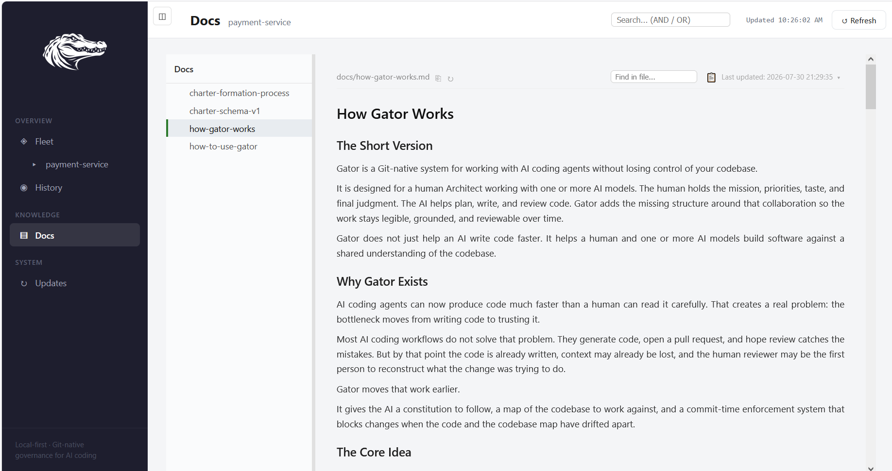

# How Gator Works

## The Short Version

Gator is a Git-native system for working with AI coding agents without losing control of your codebase.

It is designed for a human Architect working with one or more AI models. The human holds the mission, priorities, taste, and final judgment. The AI helps plan, write, and review code. Gator adds the missing structure around that collaboration so the work stays legible, grounded, and reviewable over time.

Gator does not just help an AI write code faster. It helps a human and one or more AI models build software against a shared understanding of the codebase.

## Why Gator Exists

AI coding agents can now produce code much faster than a human can read it carefully. That creates a real problem: the bottleneck moves from writing code to trusting it.

Most AI coding workflows do not solve that problem. They generate code, open a pull request, and hope review catches the mistakes. But by that point the code is already written, context may already be lost, and the human reviewer may be the first person to reconstruct what the change was trying to do.

Gator moves that work earlier.

It gives the AI a constitution to follow, a map of the codebase to work against, and a commit-time enforcement system that blocks changes when the code and the codebase map have drifted apart.

## The Core Idea

Gator turns a repository into two things at once:

1. a codebase
2. a knowledge base about that codebase

That knowledge lives inside a `.gator/` folder in the repository itself. Because it lives in Git, it travels with the repo across sessions, machines, teammates, and AI models.

This matters because important architectural knowledge should not live only:

- in one person's head
- in one AI model's temporary context window
- in one vendor's memory system

With Gator, the know-how lives in the repo.

## The Constitution

The constitution is the first layer of the system.

It is a plain-language but machine-readable document that the AI reads at session start. It tells the model how to work in this repository.

The constitution defines things like:

- what the human role is
- what the AI role is
- what must be read before code changes begin
- how charters must be maintained
- how commits are prepared
- when the AI must stop and ask for human judgment

In ordinary AI coding, the model receives a prompt and starts generating. In Gator, the model enters a governed environment first.

That is a major difference. The constitution gives the AI a working discipline, not just a task.

## The Charters

The charters are the heart of Gator.

Each charter is a compact map of one part of the codebase. A charter explains what a module owns, what it does not own, what important functions do, what they read and write, what depends on them, and what non-obvious behaviors a future model or human must not miss.

Charters are not ordinary documentation. They are operational maps.

They are specifically designed to help an AI model answer questions like:

- What part of the system should I read before changing this file?
- What functions depend on this behavior?
- What is dangerous here?
- What looks wrong but is actually intentional?
- What responsibility belongs elsewhere?

Gator charters also include negative space: **Does Not Own**. That is important. Good engineering is not just knowing what a module does. It is also knowing what it should not be responsible for.

There is also a cross-cutting charter for system-wide invariants and a charter index that acts as a dispatch table: if you are changing X, read charter Y first.

> **📷 Screenshot (TODO — `docs/images/charter-example-rendered.png`):** A real charter file rendered in the Gator Dashboard's Repo view — showing function entries with the caller/callee arrows (`←` reads-from, `→` calls) and the `!` tripwire lines. Pick a charter with genuine structure (probably `scripts-cross-cutting.md` from this repo). This is what "operational map" looks like in practice, and why it does more than documentation.

## Why the Charters Matter So Much

Without charters, each new AI session has to rebuild its understanding of the codebase from raw source files. That is slow, lossy, and error-prone.

With charters, the AI begins from a shared map of the system.

That lets:

- one human and one model stay aligned over time
- different models review the same code against the same context
- future sessions pick up where prior sessions left off
- architectural understanding become inspectable instead of tacit

In practice, this means the repo becomes easier to navigate, easier to review, and easier to maintain.

## The Loop

Gator is built around a repeatable working loop.

### 1. Session start

The AI reads the constitution and the current knowledge layer: mission, roadmap, inbox, active threads, prior commit draft, and relevant charters.

This means the session does not begin from a blank prompt. It begins from repo state.

### 2. Read before changing code

Before the AI edits code, it reads the relevant charter or charters. This is how it learns the local boundaries, invariants, tripwires, and neighboring functions before making a change.

### 3. Plan the work

For substantial work, the AI should first explain what it is going to do. In higher-discipline workflows, one model can propose a plan, a second model can challenge it, and the human Architect can adjudicate.

### 4. Make the change

The AI edits code with the charter context in mind.

### 5. Update the map immediately

As soon as a code file changes, the affected charter must also be updated. If a function changed, the charter should reflect that. If the boundary changed, the charter should reflect that. If a new tripwire was discovered, the charter should reflect that.

This is a core Gator idea: code and understanding should evolve together.

### 6. Write the commit draft

The AI records what changed and why in `commit_draft.md`. This creates a rich, structured change log before the commit is made.

### 7. Commit-time enforcement

When a commit is attempted, deterministic Git hooks run. They check whether the required governance work happened. If code changed but the map was not updated, the commit can be blocked.

> **📷 Screenshot (TODO — `docs/images/pre-commit-hook-firing.png`):** Terminal capture of `git commit` firing the Gator pre-commit hook — showing either a clean "gator pre-commit: PASS" run or a BLOCKED example with findings. The blocking case is more instructive: it shows exactly what discipline the system is enforcing. (Also used in `how-to-use-gator.md` — same file, different framing here.)

This is how Gator turns good discipline into mechanical discipline.

## Why Commit-Time Enforcement Matters

Many systems rely on good intentions: "please keep the docs updated" or "please explain what changed."

That does not hold up under AI-speed code generation.

Gator uses deterministic hooks so that the important discipline is enforced:

- code changes should be accompanied by charter updates
- commit drafts should be present
- structured metadata should be assembled consistently

This matters because it keeps the knowledge layer synchronized with the code. Without enforcement, the maps would go stale quickly. With enforcement, the repo remains navigable and trustworthy.

## The Human Role: The Architect

Gator is not built around replacing the human.

The human is the Architect. The Architect holds:

- mission
- priorities
- architectural coherence
- product judgment
- merge authority

The AI can propose. It can implement. It can review. But it does not own intent.

One of the most important questions in software is not "is this code locally correct?" It is "is this even the right thing to build, in this form, in this part of the system?"

That remains a human question.

Gator is designed to keep the human in charge of that layer even when implementation moves at model speed.

## Multi-Model Review

Gator also works well with more than one AI model.

One model can act as a grounded implementer. Another can act as a skeptical reviewer. Because both are working against the same constitution and the same charter map, they can meaningfully challenge each other's work.

This is much better than having a second model review a raw diff with no context.

Gator ships two concrete primitives for this:

**The Enforcer** — a different-model audit on demand. The primary agent finishes a piece of work; the Architect (you) triggers `enforcer-review.py`; a second model reads the diff plus the relevant charters and writes findings to a shared surface (`whiteboard.md`). The primary agent presents those findings to the Architect and asks how to proceed — it never silently acts on them. That behavioral boundary is what makes cross-model review useful rather than chaotic.

**Gator Loop** — a governed multi-agent debate. One model drafts, one reviews, and the Architect adjudicates. Rounds produce versioned artifacts (`plan.round.1.md`, `findings.round.1.md`, and so on) so the debate itself becomes part of the repo's history. Useful for decisions that are contested (approach A vs B), weighty (a significant refactor), or cross-cutting (touches multiple modules).

> **📷 Screenshot (TODO — `docs/images/dashboard-loop-in-progress.png`):** Dashboard sidebar showing an active Gator Loop with its round-versioned artifacts (`sketch.md`, `plan.current.md`, `findings.current.md`) and a status line indicating whose turn it is. Optionally include the events timeline so the audit trail is visible.

The most useful pattern is often:

- plan
- review
- adjudicate
- refine
- implement
- review again
- adjudicate again
- then commit

In that setup, review is not only a PR ritual at the end. It is built into the work itself.

## Session Summaries — the Governance Trail

Every commit that fires the pre-commit hook produces a session snippet — a small JSON record of what changed, what agent/model made the change, and what governance metadata (`Gator-*` trailers) applied. Snippets aggregate per-session into human-readable summaries under `.gator/sessions/` and are committed alongside your code.

That means the governance trail travels with the repo. Six months from now, anyone can trace what was decided, by which model, under which review discipline, on which commit. This is the missing evidence layer for AI-assisted development: not "did an AI touch this?" (git already knows) but "under what governance discipline did this AI change land?"

> **📷 Screenshot (TODO — `docs/images/dashboard-session-evidence.png`):** Dashboard view rendering a session summary — visible commits, files touched, decision tags, agent/architect identity, change type, and significance. This is what the audit trail looks like as a user-facing artifact.

Summaries are queryable through the Dashboard's History view. Nothing leaves your machine — the trail lives in your Git repo.

## The Dashboard

Gator Dashboard is the local interface for understanding what is happening in a governed repo — or across many governed repos at once.

It gives the Architect a high-signal view of the repository as a knowledge system, not just a collection of source files. Supervising AI-assisted development is a different cognitive task than actively typing code in an editor, and the Dashboard supports the supervision role.

**Fleet view** — every governed repo you have as a row, with current branch, installed CLI version, enforcement level, and drift indicators. Repos with pending template updates surface a highlighted Update button; ungoverned Git repos in your fleet surface a Gatorize button. Turns "governance across many repos" from an abstract concern into a table you can scan.

**Repo view** — click a repo name to browse its knowledge layer. Sidebar shows the `.gator/` structure (mission, roadmap, charters, threads, artifacts, procedures, docs); the main pane renders selected files as markdown. `pulse.md` (a strategic operations brief generated by `gator pulse`) is the default landing document. Full-text search across the repo's knowledge layer sits in the topbar with AND / OR boolean operators.

**Docs view** — a flat alphabetical browser over the repo's `.gator/docs/` directory. Good for team-shared onboarding notes, migration guides, and long-form context that doesn't fit into charters. The screenshot below shows the Dashboard rendering this very document (how-gator-works.md) from inside a governed repo — the same doc you're reading right now, viewed through the Dashboard on a teammate's fleet:

**History and Audit views** — surface the governance trail from Section 8 above. Every commit shows its `Gator-*` trailer metadata (agent, architect, change type, significance, decision tags). Session summaries are drillable — click a row to see what changed, what was decided, and by whom.

**Loops** — active Gator Loops appear in the sidebar with round-versioned artifacts and status. Pause, interject, or end a loop directly from the Architect's view.

**Updates** — the self-upgrade surface. Compares your installed CLI to the latest on PyPI and offers one-click upgrade + Dashboard restart.

Everything the Dashboard displays comes from local CLI commands (`gator-repo-status`, `gator-fleet-report`, `gator-audit`) and the Git state of your repos. No data is sent anywhere.

## What Gator Feels Like in Practice

For a new user, Gator usually feels like this:

1. You install Gator (`pipx install gator-command`) and open the Dashboard (`gator dashboard`).
2. You add a Git repository to your fleet — either through the Dashboard's Add Repository modal or with `gator gatorize` from the terminal. Gator creates the `.gator/` governance layer, in place, on your current branch.
3. In your first AI session, the model helps establish project identity and create the first set of charters. This is a conversation, not an automated job — your corrections make the charters accurate.
4. From then on, every serious coding session starts with context, not amnesia. The Architect (you) supervises through the Dashboard; the model does the reading, writing, and charter maintenance.
5. The AI reads the map before changing code, updates the map after changing code, and prepares a structured commit draft.
6. The hooks enforce that the important governance steps were not skipped. When a commit lands, the session snippet gets committed alongside — becoming part of the durable trail.
7. When you upgrade Gator itself (via the Dashboard's Updates section), the Fleet view surfaces which repos need a refresh. Everything else stays where it is.

The result is not just faster coding. It is a codebase that remains understandable as AI involvement increases.

## Who Gator Is For

Gator is especially useful for:

- solo builders using AI heavily
- small teams that want shared repo-native context
- people who are new to coding but want a more structured way to work with AI
- projects where maintainability matters, not just speed

It is also useful when multiple AI tools are involved, because the shared knowledge layer is stored in the repo rather than trapped in one model's memory.

## The Main Promise

Gator's promise is simple:

**AI can help write the code, but the repository should still remember what the system is, how it works, and why the change was made.**

That is what the constitution, charters, loop, and enforcement system are all for.

They let the repo accumulate understanding, not just files.

## In One Paragraph

Gator is a Git-native governance system for AI-assisted software development. It gives AI models a constitution to follow, charters to navigate by, and a commit-time enforcement loop that keeps code changes synchronized with architectural understanding. The human remains the Architect, holding mission and judgment while one or more models help plan, implement, and review. The result is a repository that becomes both codebase and knowledge base: easier to navigate, easier to trust, and easier to maintain over time.
