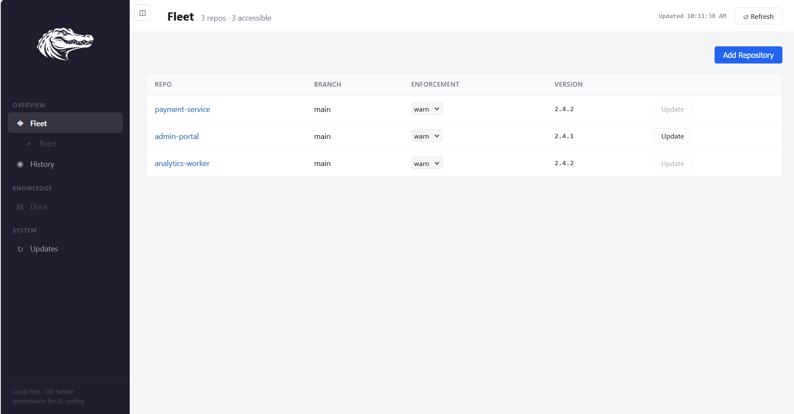
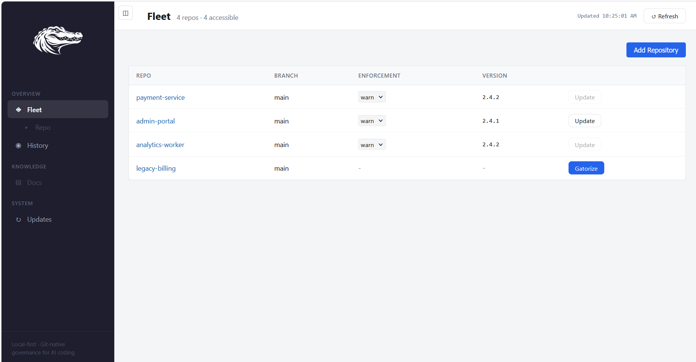
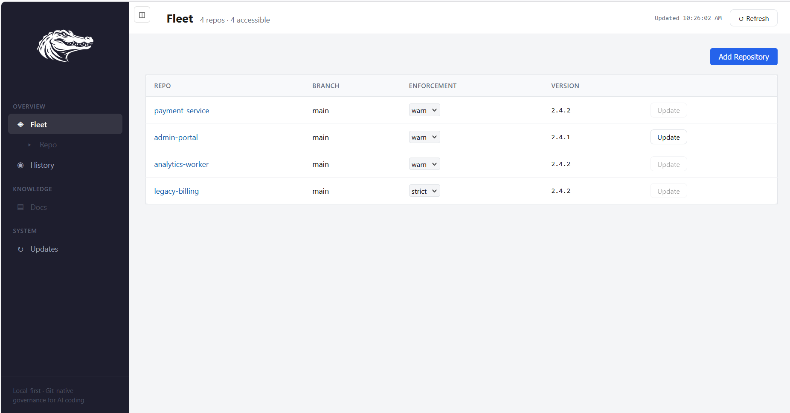

# How to Use Gator

A practical guide for new users. This walks you through installing Gator, governing your first repo, and using the knowledge layer that makes AI coding sessions architecturally coherent.

## Install

```
pipx install gator-command
```

This gives you the `gator` CLI. Verify it works:

```
gator --version
```

## Launch the Dashboard

The **Gator Dashboard** is a local web UI — the primary surface for adding repos, running governance checks, browsing the knowledge layer, and upgrading. It stays local (no data leaves your machine) and gives you a visual read on what Gator is doing.

```
gator dashboard
```

Your browser opens to `http://127.0.0.1:8420`. The first time you launch, the Fleet view is empty — that's expected. Everything from here forward can be driven either through the Dashboard or with CLI commands (both are shown as you go). Once you register repos, the Fleet view looks like this:



## Govern Your First Repo

**From the Dashboard.** Click **Add Repository**. The Dashboard scans common locations (`~/code`, `~/projects`, `~/repos`, …) and lists any Git repositories that aren't governed yet, alongside a manual path input. Pick one — Gator registers it in the Fleet. Then click the blue **Gatorize** button on that row: `gator gatorize` runs on the current branch, in place, and installs `.gator/` alongside your existing code. A dot-pulse in the activity column shows progress; on success the row refreshes to show the governed state.



**From the terminal.** Same thing, if you prefer:

```
cd your-project
gator gatorize .
```

`gator gatorize` prints a pre-action summary of exactly what it will change and asks a single Y/n gate before touching anything. Under `--yes` it refuses to run on a dirty tree — commit or stash first. If you want an isolated experiment, `git checkout -b my-gator-experiment` before running gatorize — delete that branch afterward to fully undo. Otherwise, review the diff before you commit.

Either way, you now have a `.gator/` folder inside your repo. That folder is the governance layer — it contains everything Gator uses to keep your AI coding sessions grounded in shared understanding.

### What's in `.gator/`?

Here's the shape after a first install. Some directories exist to receive shipped content, some are for your content, and a few are session-state files that never enter Git:

```
your-project/
  CLAUDE.md              <- entry-point instructions for Claude Code (tracked)
  CLAUDE.local.md        <- your personal notes, per-machine (gitignored)
  AGENTS.md, GEMINI.md   <- parallel entry points for Codex / Gemini CLI
  .gator/
    constitution.md      <- the rules your AI agent follows
    mission.md           <- what this project is and why it exists
    roadmap.md           <- current priorities
    inbox.md             <- quick idea capture
    charters/            <- the intelligent map of your codebase
    blueprints/          <- feature flow maps
    threads/             <- lightweight evolving topics
    active-threads/      <- topics currently being worked on
    artifacts/           <- deep records, design docs, analyses
    procedures/          <- repeatable workflows
    policies/            <- coding conventions and standards
    reference-notes/     <- cognitive aids and vocabulary
    field-guides/        <- language-specific pattern sheets
    docs/                <- user-authored docs travelling with the repo
    sessions/            <- committed session summaries (audit trail)
    scripts/             <- Gator's enforcement and tooling scripts
    vault/               <- sensitive files (gitignored, never committed)
    .includes/           <- shipped Gator content (updated on `gator update`)
    commit_draft.md      <- per-commit change log (gitignored, session state)
    whiteboard.md        <- ephemeral surface for review findings (gitignored)
```

The user-content directories (`mission.md`, `roadmap.md`, `charters/`, `threads/`, etc.) live at the visible `.gator/` root — they're your content, and `gator update` never touches them. Shipped Gator content (the constitution, procedures, reference-notes ship, and scripts) lives under `.gator/.includes/` on the current v2 layout and gets refreshed on every update. A few files (`commit_draft.md`, `whiteboard.md`, `status.json`) are per-commit session state and are gitignored.

The tracked knowledge layer travels with your repo via Git, so every person and every AI model that clones it gets the same architectural context. Your `*.local.md` companion files stay on your machine.

## Bootstrap: Your First Session

The first time you open an AI coding session in a gatorized repo, the model reads the constitution and sees that charters are empty. It will walk you through the bootstrap process:

1. **Establish project identity.** The model asks what your project is and populates `mission.md` and `roadmap.md`. These anchor every future session.

2. **Scan for existing knowledge.** If your repo already has `ARCHITECTURE.md`, ADRs, module READMEs, or AI instruction files (`.cursorrules`, etc.), the model offers to migrate that knowledge into `.gator/` structures.

3. **Identify module boundaries.** The model walks your directory structure and proposes how to divide the codebase into logical domains — typically 3-8 charters.

4. **Generate initial charters.** For each domain, the model reads the code and creates a charter: what the module owns, what it doesn't own, key functions, their access patterns, and any non-obvious behavior (tripwires).

5. **Build the index.** The model creates `charters/INDEX.md` — a dispatch table mapping code paths to charter files so any future session knows where to look.

6. **Write the cross-cutting charter.** This documents patterns that span multiple modules: data flows, implicit contracts, invariants. It is the most important charter in any set.

You don't need to do this manually. Just start a session and the model handles it. But you should review the output — the bootstrap is a conversation, and your corrections make the charters accurate.

## The Normal Loop

After bootstrap, every coding session follows the same loop. You don't need to ask for this — the model does it because the constitution tells it to.

**Session opening.** The model reads the constitution, mission, roadmap, inbox, and last commit draft. It picks up where the last session left off.

**Before changing code.** The model reads the relevant charters (found via `INDEX.md`) to understand the module it's about to touch — what functions exist, what they read and write, what depends on them, and what's dangerous.

**Making the change.** The model writes code grounded in charter context. It knows the invariants, the boundaries, and the tripwires.

**Updating charters.** Immediately after editing each code file, the model updates the affected charter. New functions get entries. Changed access patterns get updated. Removed functions get deleted. This is part of the edit, not an afterthought.

**Logging the change.** The model appends what happened to `commit_draft.md` — what changed, why, and what type of change it was.

**Committing.** When you authorize the commit, a pre-commit hook fires automatically. It checks that charters were updated alongside code, that the commit draft is populated, and writes a status snapshot. If something is missing, the commit is blocked and the model tells you why.

> **📷 Screenshot (TODO — `docs/images/pre-commit-hook-firing.png`):** Terminal capture of `git commit` firing the Gator pre-commit hook — showing the "gator pre-commit: PASS" (or a "BLOCKED" example) line, findings, and Gator-* trailer output. This is the moment the loop becomes mechanical — worth showing directly.

This loop is what makes AI coding sessions produce coherent software instead of disconnected code generation. The model can't just write code — it has to demonstrate understanding before and after.

## What You Can Ask For

A gatorized repo gives your AI agent a rich set of capabilities beyond just writing code. Here's what's available and how to ask for it.

### Charters — The Codebase Map

Charters are compressed operational maps of your codebase. Each one covers a module and documents its functions, their access patterns, dependencies, and dangerous behavior.

You can ask:

- "Show me the charter for the auth module"
- "What functions write to the database in this module?"
- "What depends on this function?" (the model checks `←` cross-references)
- "What would break if I changed this?" (the model traces the dependency graph)
- "Are there any tripwires I should know about before touching this file?"

The model maintains charters automatically as part of coding. You can also ask it to regenerate or improve them:

- "The charter for [module] feels thin — can you flesh it out?"
- "Add tripwire documentation for [that tricky pattern we just discussed]"

### Blueprints — Feature Flow Maps

Blueprints show how features work end-to-end, referencing the modules and functions involved. They're optional — create one when you need to understand or explain a feature's full path through the system.

- "Create a blueprint for the checkout flow"
- "How does authentication work end-to-end? Write a blueprint."
- "Which charters are involved in the payment processing flow?"

### Threads — Tracking Evolving Ideas

Threads are lightweight notes (5-20 lines) for topics that have momentum but aren't ready for a full design document. They persist across sessions so context isn't lost.

- "Create a thread about the caching strategy we've been discussing"
- "This conversation about error handling has momentum — save it as a thread"
- "What threads do we have open right now?"

Active threads live in `active-threads/` and are checked at session start. When a topic is resolved, threads move to `threads/` for reference.

### Artifacts — Deep Records

Artifacts are the long-form thinking layer. Design documents, research analyses, strategic assessments, implementation plans, post-mortems. Date-prefixed and permanently stored.

- "Write an artifact analyzing the trade-offs between approach A and approach B"
- "Create a design document for the new API layer"
- "Document what we just decided about the database migration as an artifact"

### Procedures — Repeatable Workflows

Procedures capture workflows that have stabilized — the kind of thing you'd otherwise explain from memory each time. Step-by-step, with checkpoints where a human should verify.

- "We've done this deployment process three times now — write it up as a procedure"
- "Document the release process as a procedure for next time"
- "What's the procedure for [task]?"

### Policies — Standing Rules

Policies are coding conventions and standards that apply consistently. They solve the problem of AI agents forgetting your preferences between sessions.

- "Create a policy: we always use structured logging, never print statements"
- "Write a policy for our naming conventions"
- "We never use mocks in integration tests — save that as a policy"

### Reference Notes — Cognitive Aids

Reference notes are stable definitions, vocabulary, and reference material. Things you want to look up rather than things you want to track.

- "Write a reference note explaining our event sourcing pattern"
- "Document our API versioning scheme as a reference note"
- "I keep explaining this concept to AI agents — save it as a reference note"

### Field Guides — Language-Specific Patterns

Field guides are condensed pattern references organized by language. Each has an agent-facing pattern sheet and a human-facing tutorial with real code snippets.

- "Generate a field guide for the Python patterns used in this repo"
- "What patterns does the JavaScript field guide recommend for error handling?"

### Inbox — Zero-Friction Capture

The inbox is the lowest-ceremony way to capture an idea. Anything you mention that doesn't belong in a specific place can go here.

- "Add to the inbox: we should consider rate limiting on the public API"
- "Inbox this: the cache invalidation logic might have a race condition"

The model checks the inbox at session start, so nothing gets lost.

### Vault — Sensitive Storage

The vault is gitignored — files placed here never leave your machine. Use it for credentials, large files, or private material.

- "Save this API key to the vault"
- "Put this PDF in the vault so I can reference it during the session"

### Session Summaries — Governed Evidence

Every commit that fires Gator's pre-commit hook produces a session snippet — a small JSON record of what changed, who was involved, what agent/model made the change, and what governance metadata (`Gator-*` trailers) applied. Snippets are aggregated per-session into human-readable summaries under `.gator/sessions/` — committed alongside your code, queryable in the Dashboard's Audit view (Enterprise) or the History view (Individual).

You don't have to ask for this — it happens on every commit. Where it becomes useful is when you want to:

- "Show me all commits that touched auth code in the last week — who worked on them?"
- "Which sessions changed the pricing module?"
- "Summarize what happened in that debugging session last Tuesday"

Because summaries live in Git, they travel with the repo. Any teammate (or future you) can trace what was decided and by whom — with the model identity captured for every change.

### Multi-Agent Loops — Governed Debate

Some decisions benefit from more than one model's perspective. Gator Loop is a governed planning primitive: a structured debate between two or more AI models where one drafts, one reviews, and the Architect (you) has final authority.

Use it when a decision is:
- **Contested** — approach A vs approach B, no clear winner
- **Weighty** — a significant refactor, architectural pivot, or migration plan
- **Cross-cutting** — touches multiple modules and needs coordination

- "Start a Gator Loop on whether to move the caching layer to Redis"
- "Draft the migration plan for the new auth system — I want Codex to review it"
- "What loops are in progress?"

Loops produce round-versioned artifacts under `.gator/loops/` and are visible in the Dashboard sidebar. You can pause, interject, or end them at any time.

## The Dashboard, In Depth

Once you have two or three governed repos, the Dashboard becomes the daily-use surface. It's a thin renderer over local CLI commands — everything it displays comes from `gator-repo-status`, `gator-fleet-report`, `gator-audit`, and the Git state of your repos. No data is sent anywhere.

Launch it whenever you want (safe to re-launch — the port stays consistent):

```
gator dashboard
```

**Fleet view** — the landing view. Every governed repo appears as a row: name, current branch, enforcement level, installed CLI version, and an action button (Update if governed and behind, Gatorize if ungoverned). Version-mismatch and drift indicators appear inline.



**Repo view** — click a repo name to browse its knowledge layer as a markdown file browser. Sidebar shows `.gator/` structure (mission, roadmap, charters, threads, artifacts, procedures, etc.); the main pane renders the selected file with syntax highlighting for code blocks. `pulse.md` (the strategic-operations brief generated by `gator pulse`) loads by default. Full-text search across the repo's knowledge layer is in the topbar (AND / OR boolean operators).


**History view** — recent commits from `git log`, enriched with `Gator-*` trailer metadata: agent identity, architect, change type, significance, decision tags. Turns every commit into a governance-annotated audit row.

**Docs view** — renders `.gator/docs/` (user-authored docs for the repo) in a flat alphabetical browser. Useful for team-shared onboarding notes, migration guides, or long-form context that doesn't fit into charters.

**Updates view** — the self-upgrade surface. Compares your installed CLI to the latest on PyPI and offers a one-click Upgrade button. Also the entry point for restarting the Dashboard cleanly.

## Working with a Team

Gator distinguishes three surfaces so team decisions travel through Git and personal notes stay on your machine:

- **The Gator-managed block** in `CLAUDE.md` / `AGENTS.md` / `GEMINI.md` (between `<!-- GATOR:BEGIN -->` and `<!-- GATOR:END -->` sentinels) — governance instructions Gator refreshes on update. You don't edit this.
- **The rest of the entry-point file** (outside the sentinels, tracked in Git) — repo-shared instructions to the agent. Team-visible.
- **`CLAUDE.local.md` / `AGENTS.local.md` / `GEMINI.local.md`** at the repo root — personal per-machine notes. Gitignored automatically. Gator never reads, writes, or overwrites them.

For the full team-workflow perspective — what Gator manages in the vendor `.claude/` (or `.codex/`, `.gemini/`) directories, the four Gator-owned slash commands, how team-shared skills travel through PRs, and the decision guide for personal vs team-shared content — see [Custom Skills and Team Workflow](custom-skills-and-team-workflow.md).

## Upgrading

**From the Dashboard.** Open the sidebar's **Updates** section — the Dashboard checks PyPI and shows the currently-installed version alongside the latest. If a new version is out, click **Upgrade**: the Dashboard runs `pipx upgrade gator-command` in a detached helper, restarts itself, and reloads the browser page when it's back. After the CLI upgrade, the Fleet view's per-row **Update** button refreshes each governed repo's templates, hooks, and managed entry-point blocks in place — click it as needed. The Version column tells you which repos are behind.

> **📷 Screenshot (TODO — `docs/images/dashboard-upgrade-flow.png`):** Split image or two-panel — top: Updates view with the version comparison and Upgrade button; bottom: Fleet view with an Update button highlighted on a repo that needs the refresh.

**From the terminal.**

```
pipx upgrade gator-command
```

Then refresh each governed repo (from inside the repo, or via `--path`):

```
gator update
```

`gator update` operates on the current branch, in place. Your content is always preserved — only Gator templates, scripts, and the managed region inside `CLAUDE.md` / `AGENTS.md` / `GEMINI.md` refresh. If the managed region gets modified, `.pre-gator-update` sibling backups are written before overwrite.

## Key Concepts

**The constitution** governs how AI agents behave in your repo. It defines the loop, the rules, and the roles. You can customize it, but the defaults work well out of the box.

**Charters are the core innovation.** They are not documentation in the traditional sense. They are compressed operational maps written by AI models for future AI models, with the human using them as an audit surface. They force the model to externalize its understanding of the codebase, making that understanding inspectable and correctable.

**The pre-commit hook is the enforcement mechanism.** It ensures that code changes and charter updates stay synchronized. Without it, the discipline would degrade under the speed of AI generation. With it, the governance loop is mechanical, not aspirational.

**Knowledge lives in the repo, not in model memory.** AI models have their own memory systems, but those are invisible to other users and other models. Everything important goes in `.gator/` so it's shared, versioned, and durable.

**You are the Architect.** You hold mission, taste, and architectural coherence. The AI agents propose; you decide. The system is designed to keep you in control of intent and direction even when implementation moves at model speed.
